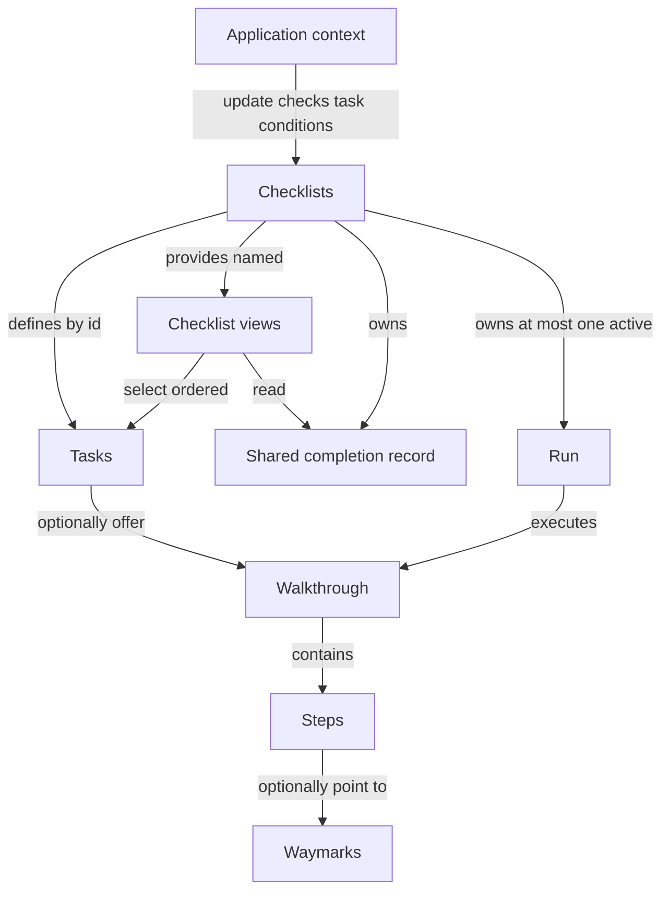

# Checklist design

Show completed and remaining tasks, with optional descriptions, application actions,
and walkthroughs for guidance.
Terms: [CONTEXT.md](CONTEXT.md). Signatures describe the proposed interface.

## Domain overview

A **task** is one objective, such as creating a deck. Several checklists can
show that task; completing it updates every checklist that includes it.

| Term | Meaning |
|---|---|
| Task | An objective with an optional description, application action, walkthrough, and completion condition. Its map key is its stable id. |
| Checklist | A named, ordered view of tasks and their shared completion. |
| Checklists | The object returned by `createChecklists`: owns the tasks, checklist views, completion record, and at most one active Run. |
| Context | Application information supplied to completion checks, such as `hasDeck`. |
| Completion condition | A task's `isComplete(context)` check. True records the task as done even if its walkthrough never ran. |
| Walkthrough | Reusable instructions showing how to accomplish a task. |
| Step | One instruction within a walkthrough. It may point to a waymark. |
| Waymark | A page element a step points to. |
| Run | One live execution of a walkthrough, tracking its current step and advancement. |



Separate `createChecklists` calls have independent records. Reusing a task
object across those calls shares its definition, not its completion.

## Descriptions, actions, and walkthroughs

A description explains a task directly in its checklist row. A short explanation
may be enough without defining or opening a walkthrough. A one-step walkthrough
remains useful when the instruction should point to an element in the page.
Descriptions are optional and should stay short so the checklist remains easy to scan.

An application action runs only when the user selects its button. It can navigate,
open a dialog, or invoke another application operation. A task may offer an action,
a walkthrough, both, or neither. The default checklist shows one primary button:

| Task configuration | Primary button behaviour |
|---|---|
| Action only | Show `action.label` and invoke `action.onSelect`. |
| Walkthrough only | Start the walkthrough through `start(id)`; offer replay after completion. |
| Action and walkthrough | Show the action button. The application decides whether and when to call `start(id)`. Do not automatically run both or add a second button. |
| Neither | Show the title and optional description without a primary action button. |

Custom rendering may expose both choices. An action can, for example, open the
relevant page and call `start(id)` when that page is ready for guidance.
`start(id)` always starts the walkthrough, even when the task also has an action.

Descriptions and labelled actions belong to the rendering adapter, alongside the
title. Core preserves these extra task fields in snapshots but does not invoke
actions. An action creates no Run, changes no active task, and emits no checklist
event by itself. It also does not stop existing guidance unless the application
calls `stop()` or starts another walkthrough. The application owns asynchronous
work, errors, and any prevention of repeated invocation.

Displaying a description or invoking an action does not mark a task done.
Completion still comes from `isComplete(context)`, an explicit `markDone(id)`,
or finishing a walkthrough that has no completion condition. A task without a
walkthrough or condition offers manual completion, including when it has an action.
For an information-only task, that control acknowledges the information. If text
does not need acknowledgement, use it as another task's description rather than
creating an extra task to tick off.

## Caller interface

```ts
// Create once in application setup, outside framework rendering.
const collection = createChecklists({
  context: { hasDeck: false, hasPhoto: false }, // initial values also infer the type
  tasks: {
    "create-deck": {
      walkthrough: createDeckWalkthrough,
      isComplete: (context) => context.hasDeck, // inferred: { hasDeck: boolean; hasPhoto: boolean }
    },
    "add-photo": {
      walkthrough: addPhotoWalkthrough,
      isComplete: (context) => context.hasPhoto,
    },
  },
  checklists: {
    home: ["add-photo", "create-deck"],
    decks: ["create-deck"],
    // broken: ["missing-task"], // Type error: not a key of tasks.
  },
});

collection.update({ hasDeck: true, hasPhoto: false });
// create-deck is now done in both home and decks.
// collection.update({ hasDeck: true }); // Type error: hasPhoto is required.

collection.checklists.decks.start("create-deck");
// collection.checklists.decks.start("add-photo"); // Type error: not in decks.
collection.checklists.home.skip("add-photo"); // Skipped on home only.
collection.stop(); // Ends any active guidance.
```

## Tasks and selections

```ts
// One objective. TContext types application data; TStep types walkthrough instructions.
// Map keys supply ids. Tasks written inline are typed from the initial context;
// tasks in other files go through defineTask (below).
type Task<TContext, TStep extends Step = Step> = Readonly<{
  walkthrough?: Walkthrough<TStep>;
  // Pure synchronous check; update(context) evaluates it and records completion.
  // Without this condition, finishing the active walkthrough records done.
  // The application may also call markDone, including for tasks without guidance.
  isComplete?: (context: TContext) => boolean;
}>;

// For tasks declared outside createChecklists. An arrow parameter is typed by
// the expression it is written in, so a task in its own file has no context
// type unless something supplies it. Curried, as in Zustand's create<T>()():
// TypeScript cannot infer TStep while TContext is given by hand in one call.
//   export type AppContext = typeof initialContext;   // once, in setup
//   "create-deck": defineTask<AppContext>()({ walkthrough, isComplete: (c) => c.hasDeck })
declare function defineTask<TContext>(): <const TTask extends Task<TContext, any>>(
  task: TTask,
) => TTask;

// The inferred keys are the only valid task ids.
type TaskMap<TContext> = Readonly<Record<string, Task<TContext, any>>>;
type TaskId<TTasks> = keyof TTasks & string;

// Each checklist name maps to task ids in display order.
type ChecklistSelections<TTasks> = Readonly<
  Record<string, readonly TaskId<TTasks>[]>
>;

// Recover the instructions carried by tasks; tasks without guidance contribute
// no step type. Distribute over task unions and retain custom step fields.
type StepOf<TTask> = TTask extends unknown
  ? "walkthrough" extends keyof TTask
    ? NonNullable<TTask["walkthrough"]> extends Walkthrough<infer TStep>
      ? TStep
      : never
    : never
  : never;

// Snapshot rows expose a task's map key alongside its original fields.
// The mapped union preserves the relationship between each id and its definition.
type NamedTask<TTasks, TId extends TaskId<TTasks> = TaskId<TTasks>> = {
  [K in TId]: Readonly<TTasks[K] & { id: K }>;
}[TId];

// Select exactly the task types named by one checklist's id array.
type SelectedTask<TTasks, TIds extends readonly TaskId<TTasks>[]> =
  NamedTask<TTasks, TIds[number]>;
```

## Saved state and snapshots

```ts
// Remaining, accomplished, or deliberately skipped. Active guidance is separate.
type TaskStatus = "todo" | "done" | "skipped";

// One persisted record per createChecklists call. Done is shared by every
// view; skipped is per checklist, keyed by checklist name.
// Active Run, step, and walkthrough history are not stored. No version field:
// storage adapters wrap the record in their own envelope.
type Stored = Readonly<{
  done: readonly string[]; // task ids, treated as a set
  skipped: Readonly<Record<string, readonly string[]>>; // checklist name -> task ids
}>;

// Current display data for one checklist, not a separate completion record.
// Done is the same in every view; skipped is this checklist's own.
type ChecklistSnapshot<TTask extends { readonly id: string }> = Readonly<{
  tasks: readonly Readonly<{ task: TTask; status: TaskStatus }>[];
  finishedCount: number; // done plus skipped here
  taskCount: number; // selected task count
  complete: boolean; // finishedCount === taskCount
  // The shared active Run only when its task belongs to this checklist.
  // A done or skipped task may still have active guidance.
  active: Readonly<{ task: TTask; run: Run<StepOf<TTask>> }> | null;
}>;

// Commands scoped to the selected tasks; they delegate to the shared owner.
// Skip belongs to the view because it is recorded per checklist.
type TaskCommands<TId extends string> = Readonly<{
  start: (id: TId) => void; // starts/replays guidance; exits any previous shared Run
  markDone: (id: TId) => void; // records done everywhere; guidance can continue
  skip: (id: TId) => void; // todo -> skipped in this checklist; exits this task's active Run
}>;

// Framework-neutral live view. Does not own storage or application context.
type Checklist<TTask extends { readonly id: string }> =
  TaskCommands<TTask["id"]> & Readonly<{
    getSnapshot: () => ChecklistSnapshot<TTask>; // stable until observable change
    subscribe: (listener: () => void) => () => void; // returns unsubscribe
  }>;
```

## Shared owner and creation

```ts
// Task events occur once per shared transition, not once per checklist view.
// taskStarted/taskStopped describe walkthrough Runs, not application actions.
// Skip and checklist completion name the view they happened in.
// Order within one change: task events first, then checklistComplete for each
// view that went from incomplete to complete, in declaration order.
// checklistComplete carries that view's committed snapshot, so a handler such
// as a celebration reads counts from the event instead of the owner.
// Creation emits no events (see Transition contract).
type ChecklistsEvent<TTasks, TSelections extends ChecklistSelections<TTasks>> =
  | Readonly<{
      type: "taskStarted" | "taskComplete";
      task: NamedTask<TTasks>;
    }>
  | Readonly<{
      type: "taskStopped";
      task: NamedTask<TTasks>;
      // finished: reached the last step. skipped: a view skipped it.
      // stopped: exit from the popover, stop(), or start() of another task.
      reason: "finished" | "skipped" | "stopped";
    }>
  | Readonly<{
      type: "taskSkipped";
      task: NamedTask<TTasks>;
      checklist: keyof TSelections & string;
    }>
  | Readonly<{
      type: "checklistComplete";
      checklist: keyof TSelections & string;
      snapshot: ChecklistSnapshot<NamedTask<TTasks>>;
    }>;

// Storage and listeners are configured once, outside framework hooks.
type ChecklistsOptions<TTasks, TSelections extends ChecklistSelections<TTasks>> = Readonly<{
  stored?: Stored; // starts empty if omitted
  onChange?: (stored: Stored) => void; // whole shared record after local changes
  onEvent?: (event: ChecklistsEvent<TTasks, TSelections>) => void;
  // Shared Run options. Core supplies startAt and ui itself, and wraps onEvent:
  // it handles finish and exit first, then calls the supplied listener.
  run?: Omit<RunOptions<StepOf<TTasks[keyof TTasks]>>, "startAt" | "ui">;
}>;

// Turn each named selection into a live view of only those tasks.
// Literal task ids and checklist names are preserved.
type ChecklistViews<
  TTasks,
  TSelections extends ChecklistSelections<TTasks>,
> = {
  readonly [Name in keyof TSelections]:
    Checklist<SelectedTask<TTasks, TSelections[Name]>>;
};

// Live owner returned by createChecklists. Context is inferred from initial values.
type Checklists<
  TContext,
  TTasks,
  TSelections extends ChecklistSelections<TTasks>,
> = Readonly<{
  checklists: ChecklistViews<TTasks, TSelections>;

  start: (id: TaskId<TTasks>) => void; // starts/replays guidance; exits previous Run
  stop: () => void; // exits the active Run; no-op when nothing is active
  markDone: (id: TaskId<TTasks>) => void; // records done across all views
  // Skip is a view command: it is recorded per checklist, so the owner has none.

  // For the single app-level walkthrough renderer. Core reads the active Run's
  // UI elements through the bound getter; one binding at a time, newest wins.
  bindUi: (ui: () => UiElements) => () => void; // returns release
  // The owner is a store on the same terms as views and Runs: the snapshot
  // changes identity only when the active task changes.
  getSnapshot: () => Readonly<{
    active: Readonly<{ task: NamedTask<TTasks>; run: Run<any> }> | null;
  }>;
  subscribe: (listener: () => void) => () => void; // fires when active changes

  // Check each non-done task once, even if it appears in several views.
  // True overrides skipped in every checklist. Done stays recorded until load/clear. No polling.
  // Requires the full inferred shape; missing fields are TypeScript errors.
  update: (context: TContext) => void;
  // Authoritative replacement; no onChange or transition events.
  // Stale data can roll back local changes; the application owns conflict policy.
  load: (stored: Stored) => void;
  // Empty all progress, including unknown ids/names, and call onChange once.
  // Keep the active Run; no transition events. No-op if already empty.
  clear: () => void;
}>;

// Infer context from its initial values only; checks must accept that shape.
// Context is not const-inferred: false/true should widen to boolean.
// No generics at the creation site; only tasks in other files need defineTask.
declare function createChecklists<
  TContext,
  const TTasks extends TaskMap<NoInfer<TContext>>,
  const TSelections extends ChecklistSelections<TTasks>,
>(config: Readonly<{
  context: TContext; // required initial application data, not just a type declaration
  tasks: TTasks;
  checklists: TSelections;
}> & ChecklistsOptions<TTasks, TSelections>): Checklists<TContext, TTasks, TSelections>;
```

Validate non-empty task/checklist maps and checklist selections, non-empty names,
and known, non-repeated task ids within each selection. Reuse across selections is allowed.
Task map insertion order controls condition checks; selection order controls rows.

## Transition contract

Creation normalises the stored record, then checks initial context as `update`
would: matching conditions are recorded done and `onChange` fires if the record
changed. Creation emits no events: the returned object is not assigned yet, and
a reload must not repeat `checklistComplete` for a view storage already had
complete. A normalisation-only difference is not saved until the next real change.
Initial values are real data; later updates supply the full context shape.
Types check callers at compile time, not untyped runtime input.

One owner holds one user's progress. Create it once during browser setup for
that user. Checklist and guidance rendering are browser-only in this version.
Server-rendered applications render an empty region or an application-owned
placeholder, then create the owner and mount the checklist UI on the client.
The placeholder must also be the client's initial hydration output; checking
for `window` during render alone is not a client-only mounting strategy.
Adapters do not provide server checklist snapshots or synchronise server and
browser owners. A Run holds page listeners only while subscribed, and renderers
unsubscribe on unmount.

| Input | Shared state change |
|---|---|
| `start(id)` | Exit the previous Run, commit the new active task, create its Run with core's own `onEvent`. Finish and exit are observed there; core never subscribes to the Run, since subscribing switches on page watching. No-op without guidance or if already active. |
| `stop()` | Exit the active Run and clear active. No-op when nothing is active. |
| Run finishes without `isComplete` | Mark its task done and clear active, updating every affected view. |
| Run finishes with `isComplete` | Clear active; finishing instructions does not assert application completion. |
| Run exits | Clear active; retain completion. |
| `markDone(id)` | Record done, remove skipped. No-op if already done. |
| `skip(id)` on a view | Record skipped for that checklist and exit the task's active Run. No-op if done or already skipped there. |
| `update(context)` | Evaluate eligible conditions once in task order; commit all resulting completions together. |
| `clear()` | Replace progress with `{ done: [], skipped: {} }`, including unknown task ids and checklist names. Notify changed views and call `onChange` once; emit no transition events. Keep the active Run and context; do not re-check conditions. No-op if already empty. |

- Shared task ids couple completion; sharing only a Walkthrough object does not.
- Commit affected snapshots before callbacks. Notify each changed view once and call `onChange` once per record change.
- Unaffected views retain snapshot identity. Shared active tasks appear active in every view containing them.
- Normalise stored arrays: deduplicate, done removes the task from every checklist's skipped list, known ids in task map order.
- Preserve unknown task ids and unknown checklist names in input order across local changes, except `clear` removes them; `load` replaces them.
- `load` replaces the record, including unknown ids. It notifies changed views without persistence callbacks or events. Use `clear()` to clear progress and persist that change through `onChange`.
- Completion counts include tasks skipped in that checklist. A skipped -> done transition does not repeat a view's completion event.
- Starting policy stays with the app; a view's next task is a find over its snapshot.
- Conditions run only in `update`. A Run finishing does not re-check its task's `isComplete`; frameworks push context through their own sync, plain apps call `update`.
- Commands complete before returning, except when called inside a view listener or `onEvent` handler. Those calls enqueue and run after the current notifications and events finish, as the Run's `act` does.

## Persistence

```ts
// Optional browser adapter shared across frameworks; core keeps progress in memory
// and never accesses local storage itself.
// Non-empty records write { version: 1, record }.
// Empty records remove the key with removeItem(key), rather than storing "null".
// Empty means no done ids and no skipped ids, including unknown ids/names.
// Missing, invalid, or unknown-version -> empty record.
// Storage errors (private mode, quota) are swallowed here only: load returns
// empty, save does nothing. A user-supplied onChange that throws propagates.
declare function createLocalStorageRecord(key: string): Readonly<{
  load: () => Stored;
  save: (stored: Stored) => void;
}>;

// Application setup owns both the storage key and live instance.
const record = createLocalStorageRecord("study-setup");
const collection = createChecklists({
  context: { hasDeck: false, hasPhoto: false }, // initial values also infer the type
  tasks: { ...accountTasks, ...deckTasks }, // built with defineTask<AppContext>() in their own files
  checklists: { home: ["add-photo", "create-deck"], decks: ["create-deck"] },
  stored: record.load(),
  onChange: record.save,
});
// Remote persistence uses stored/onChange too; later records enter via collection.load.

collection.clear();
// Clears live progress and calls onChange with { done: [], skipped: {} }.
// With record.save wired above, this removes the local-storage key.
// A subsequent localStorage.getItem("study-setup") returns null.
```

Omit `stored` and `onChange` for memory-only progress. Custom persistence supplies
initial data through `stored` and saves changes through `onChange`; it decides
how to store or delete an empty record. `load(record)` accepts incoming progress
without saving it back. `clear()` changes progress locally and calls `onChange`
when the record changes. Later updates or Run completion can record progress again.

## Adapter contract

Framework-neutral. Every adapter, React or otherwise, maps these core facts to
its own lifecycle; nothing here is React-specific.

| Core fact | What an adapter does |
|---|---|
| Views and the owner are stores (`getSnapshot`, `subscribe`). | Subscribe in its reactive primitive after client-only mounting. Server rendering shows an empty region or an application-owned placeholder. |
| The owner's active Run must be drawn by exactly one renderer. | Ship one guidance component that reads `getSnapshot().active` and draws the Run's popover and beacon. |
| The Run needs its UI elements to tell clicks on them from clicks away. | Call `bindUi` when the guidance component mounts, release on unmount. |
| Removing the guidance renderer ends its active Run, retaining completed and skipped tasks. | Mount the renderer at the root for cross-page guidance, or inside a page to end guidance when that page unmounts. Temporary framework cleanup and reattachment must not stop the Run. |
| Commands are plain functions on views and the owner. | Expose them unchanged; no wrapping needed. |
| Context changes only through `update`. | The app calls it from the framework's effect or sync mechanism. |

## React adapter

```ts
// React extends task content, not state ownership. No React-specific creation phase.
// Core createChecklists preserves these extra fields in checklist snapshots.
type ReactTask<TContext> = Task<TContext, WalkthroughStep> & Readonly<{
  title: ReactNode;
  description?: ReactNode; // shown inline beneath the title; no Run needed
  action?: Readonly<{
    label: ReactNode;
    onSelect: () => void; // invoked directly by the UI on selection
  }>;
}>;

// The existing Walkthrough component gains a second prop shape. With
// `walkthrough` it creates and owns a Run, as today. With `checklists` it draws
// whichever Run the owner started, binds its elements through bindUi on mount,
// and releases on unmount. Removing the renderer also stops its active Run.
// Both shapes share popover, beacon, shade, and placement code. Padding and
// onEvent are owner options in the second shape.
// Checklist views never render guidance, so two views showing the same task on
// one page still give one popover. Mount at the root for guidance that survives
// route changes, or inside a page to stop guidance when that page unmounts.
type WalkthroughProps<TStep extends WalkthroughStep> = Readonly<{
  walkthrough: Walkthrough<TStep>; // self-owned Run, unchanged
  checklists?: never;
  active?: boolean;
  waymarkPadding?: number;
  onEvent?: (event: RunEvent<TStep>) => void;
  renderPopover?: (props: WalkthroughRenderProps<TStep>) => ReactNode;
}>;

// Infer tasks and their step union from the supplied owner. No caller-written
// generics. Every walkthrough must contain React-compatible display content.
type ReactGuidanceTasks = Readonly<Record<string, Task<any, WalkthroughStep>>>;
type ChecklistWalkthroughProps<
  TContext,
  TTasks extends ReactGuidanceTasks,
  TSelections extends ChecklistSelections<TTasks>,
> = Readonly<{
  checklists: Checklists<TContext, TTasks, TSelections>;
  walkthrough?: never;
  active?: never;
  waymarkPadding?: never;
  onEvent?: never;
  renderPopover?: (props: WalkthroughRenderProps<
    NoInfer<Extract<StepOf<TTasks[keyof TTasks]>, WalkthroughStep>>
  >) => ReactNode;
}>;
declare function Walkthrough<TStep extends WalkthroughStep>(
  props: WalkthroughProps<TStep>,
): ReactElement | null;
declare function Walkthrough<
  TContext,
  TTasks extends ReactGuidanceTasks,
  TSelections extends ChecklistSelections<TTasks>,
>(
  props: ChecklistWalkthroughProps<TContext, TTasks, TSelections>,
): ReactElement | null;

// Core Checklist is imported as CoreChecklist in the React module.
// Custom rendering receives existing commands and display data.
type UseChecklistResult<TTask extends ReactTask<any> & { readonly id: string }> =
  TaskCommands<TTask["id"]> & Readonly<{
    snapshot: ChecklistSnapshot<TTask>;
  }>;

declare function useChecklist<TTask extends ReactTask<any> & { readonly id: string }>(
  checklist: CoreChecklist<TTask>,
): UseChecklistResult<TTask>;

// Default UI subscribes to the same view as custom UI. Styled with inline
// defaults like the popover; style props override, renderRow replaces a row,
// labels replace the English button text. Full custom rendering uses useChecklist.
type ChecklistLabels = Readonly<{ start: ReactNode; replay: ReactNode; markDone: ReactNode; skip: ReactNode }>;
type ChecklistRowProps<TTask extends ReactTask<any> & { readonly id: string }> =
  TaskCommands<TTask["id"]> & Readonly<{ task: TTask; status: TaskStatus; active: boolean }>;
type ChecklistProps<TTask extends ReactTask<any> & { readonly id: string }> = Readonly<{
  checklist: CoreChecklist<TTask>;
  style?: CSSProperties;
  rowStyle?: CSSProperties;
  labels?: Partial<ChecklistLabels>;
  renderRow?: (props: ChecklistRowProps<TTask>) => ReactNode;
}>;
declare function Checklist<TTask extends ReactTask<any> & { readonly id: string }>(
  props: ChecklistProps<TTask>,
): ReactElement | null;
```

The React adapter releases subscriptions and UI bindings during effect cleanup.
It defers stopping the active Run to a microtask and cancels that stop if the
same renderer reattaches during Strict Mode's setup/cleanup/setup cycle. A
pending stop belongs to the owner, Run, and renderer binding being released;
it must not stop a replacement Run or guidance acquired by another renderer.
If no reattachment cancels the pending stop, the adapter stops that Run and
clears active guidance. Completed and skipped tasks remain unchanged.

```tsx
// Task content is preserved by createChecklists, just like walkthrough content.
const collection = createChecklists({
  context: { hasDeck: false, hasPhoto: false },
  tasks: {
    "create-deck": {
      title: "Create your first deck",
      description: "Decks group the cards you want to study.",
      walkthrough: createDeckWalkthrough,
      isComplete: (context) => context.hasDeck,
    },
    "add-photo": {
      title: "Add a profile photo",
      description: "Choose a photo so your teammates can recognise you.",
      action: { label: "Choose photo", onSelect: () => openPhotoPicker() },
      isComplete: (context) => context.hasPhoto,
    },
    "understand-sharing": {
      title: "Understand sharing",
      description: "Your decks stay private until you share them.",
      // No walkthrough or action. Manual completion acknowledges the information.
    },
  },
  checklists: { home: ["create-deck", "add-photo", "understand-sharing"] },
});

// When an action and walkthrough coexist, the application controls sequencing:
// action: {
//   label: "Create a deck",
//   onSelect: () => {
//     openCreateDeckDialog();
//     // Call collection.start("create-deck") when the dialog is ready.
//   },
// },
```

```tsx
// Internal subscription, inside the client-only mounted checklist UI.
// useChecklist consumers must use the same client-only mounting strategy.
const snapshot = useSyncExternalStore(
  checklist.subscribe,
  checklist.getSnapshot,
);

// Once, at the app root: guidance follows the user across routes.
<Walkthrough checklists={collection} />
// Custom popovers infer currentStep from the owner's walkthroughs. If only
// some steps have helpUrl, narrow before using it; no explicit generic needed.
<Walkthrough
  checklists={collection}
  renderPopover={({ currentStep }) => <>{currentStep.content}</>}
/>
// Or inside a route: guidance ends when this page unmounts.
<Walkthrough checklists={collection} />

// Route chooses the view. React tasks include title and walkthrough display content.
<Checklist checklist={collection.checklists.home} />

// Headless alternative.
const { snapshot, start } = useChecklist(collection.checklists.decks);
<ChecklistPanel snapshot={snapshot} onStart={start} />
```

| Responsibility | Owner |
|---|---|
| Context updates | Application calls `collection.update(context)` once for shared tasks. React views do not independently supply conflicting context. |
| Completion, active Run, storage callbacks | Shared Checklists object, outside React. |
| Guidance rendering | One `Walkthrough checklists={...}` mounted at a time. Views never render it. |
| UI subscription | `useSyncExternalStore`; views have stable identities. |
| Default UI | Titles, inline descriptions, statuses, active task, finished count, action buttons or guidance/replay according to the precedence above, skip, and manual completion for todo tasks without a walkthrough or a condition. |
| Application actions | The UI invokes `action.onSelect` on selection. The application owns navigation, dialogs, asynchronous work, and any calls to start or stop guidance. |
| Unmount | Hooks disconnect their subscriptions. Removing the guidance component releases its UI binding and stops its active Run, retaining progress. Temporary cleanup and reattachment do not stop guidance. |

## Settled

- Core builds on the queued Run runtime, which is now the only implementation in the repo.
- The name Run stays.
- Descriptions and labelled application actions are optional adapter content. Actions take precedence over walkthrough buttons in the default UI; `start(id)` remains walkthrough-only.
- Descriptions and actions do not imply completion or create an active task. Actions and walkthroughs may coexist, with sequencing owned by the application.
- Skip is per checklist. Done is shared and wins over skipped everywhere.
- `clear()` empties all progress and persists through `onChange`; `load()` receives progress without saving it back. Un-doing a single task has no use case yet.
- Local storage is opt-in. Its adapter removes the key when saving an empty record; custom persistence decides how to handle that record.
- `stop()` on the owner ends active guidance.
- Creation checks context and persists like `update`, but emits no events.
- `checklistComplete` carries the view's snapshot, typed over all tasks.
- Replays fire `taskStarted`/`taskStopped` as normal; `taskComplete` never repeats.
- The local storage adapter swallows storage errors; user callbacks are never wrapped.
- `run` options are fixed at creation; `start(id)` takes no options. Per-task overrides can come later.
- Delivery includes type-level tests for the inference claims and a checklist page in the e2e playground. Renderer tests cover custom step inference, mixed step types, tasks without guidance, rejection of non-React steps, and mutually exclusive prop shapes. Lifecycle tests cover Strict Mode mounting with a prestarted Run, actual unmount, retained progress, and pending cleanup after Run replacement or renderer handoff.
- One owner per browser user scope. Adapters release subscriptions and UI bindings on unmount.
- The owner is a store: `getSnapshot()` returns `{ active }`; `bindUi` keeps its name.
- One React `Walkthrough` component with two prop shapes. Removing its renderer stops guidance; temporary React cleanup and reattachment do not.
- Default `Checklist` is styled with inline defaults and style props, like the popover; `useChecklist` is the headless route.
- Checklist and guidance rendering are browser-only. Server-rendered applications mount them after a matching empty region or placeholder; no server checklist snapshot is provided.
- Custom popovers infer their step union from the supplied owner's tasks. Callers need no explicit generic; fields present on only some steps require narrowing.
- Core observes the Run through `onEvent`, never `subscribe`.
- One guidance renderer per owner; views only render lists and commands.
- A root-mounted renderer keeps guidance across route changes. A page-mounted renderer stops guidance when removed; the app can also call `stop()` explicitly.
- Versioning lives in the storage adapter's envelope, not in `Stored`.
- `taskStopped` carries `reason: "finished" | "skipped" | "stopped"`.
- Event order per change: task events, then `checklistComplete` for each newly complete view in declaration order.
- Conditions run only in `update`; finishing a walkthrough does not re-check them.
- Tasks in separate files use the curried `defineTask<AppContext>()` helper; inline tasks need nothing.
- Commands are re-entrant on the same terms as the Run's `act`.
- Ships from the existing `waymark` and `react-waymark` entry points; both are `sideEffects: false`.

## Deferred

- Server-rendered checklist content and transfer of initial state for hydration.
- Context syncing helper for framework-owned state. Each framework brings its own effect-style sync that calls `update`.
- Un-doing a task or clearing part of the record through the API.
- Dependencies/locked tasks, polling, automatic starts, and stored walkthrough history.
- Cross-device merging; application-owned conflict policy first.
- Svelte-style subscriptions that pass snapshots to listeners.
