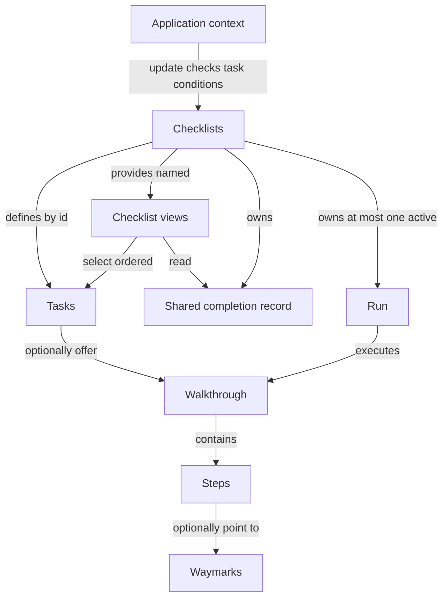

# Checklist design

Show completed and remaining tasks, with optional walkthroughs for guidance.
Terms: [CONTEXT.md](CONTEXT.md). Signatures describe the proposed interface.

## Domain overview

A **task** is one objective, such as creating a deck. Several checklists can
show that task; completing it updates every checklist that includes it.

| Term | Meaning |
|---|---|
| Task | An objective with optional instructions and a completion condition. Its map key is its stable id. |
| Checklist | A named, ordered view of tasks and their shared completion. |
| Checklists | The object returned by `createChecklists`: owns the tasks, checklist views, completion record, and at most one active Run. |
| Context | Application information supplied to completion checks, such as `hasDeck`. |
| Completion condition | A task's `isComplete(context)` check. True records the task as done even if its walkthrough never ran. |
| Walkthrough | Reusable instructions showing how to accomplish a task. |
| Step | One instruction within a walkthrough. It may point to a waymark. |
| Waymark | A page element a step points to. |
| Run | One live execution of a walkthrough, tracking its current step and advancement. |



Separate `createChecklists` calls have independent records. Reusing a task
object across those calls shares its definition, not its completion.

## Caller interface

```ts
// Create once in application setup, outside framework rendering.
const collection = createChecklists({
  context: { hasDeck: false, hasPhoto: false }, // initial values also infer the type
  tasks: {
    "create-deck": {
      walkthrough: createDeckWalkthrough,
      isComplete: (context) => context.hasDeck, // inferred: { hasDeck: boolean; hasPhoto: boolean }
    },
    "add-photo": {
      walkthrough: addPhotoWalkthrough,
      isComplete: (context) => context.hasPhoto,
    },
  },
  checklists: {
    home: ["add-photo", "create-deck"],
    decks: ["create-deck"],
    // broken: ["missing-task"], // Type error: not a key of tasks.
  },
});

collection.update({ hasDeck: true, hasPhoto: false });
// create-deck is now done in both home and decks.
// collection.update({ hasDeck: true }); // Type error: hasPhoto is required.

collection.checklists.decks.start("create-deck");
// collection.checklists.decks.start("add-photo"); // Type error: not in decks.
collection.reset("create-deck"); // Clears this task across all views.
```

## Tasks and selections

```ts
// One objective. TContext types application data; TStep types walkthrough instructions.
// Map keys supply ids, so task objects can be declared in separate files and reused.
type Task<TContext, TStep extends Step = Step> = Readonly<{
  walkthrough?: Walkthrough<TStep>;
  // Pure synchronous check; update(context) evaluates it and records completion.
  // Without this condition, finishing the active walkthrough records done.
  // The application may also call markDone, including for tasks without guidance.
  isComplete?: (context: TContext) => boolean;
}>;

// The inferred keys are the only valid task ids.
type TaskMap<TContext> = Readonly<Record<string, Task<TContext, any>>>;
type TaskId<TTasks> = keyof TTasks & string;

// Each checklist name maps to task ids in display order.
type ChecklistSelections<TTasks> = Readonly<
  Record<string, readonly TaskId<TTasks>[]>
>;

// Recover the instructions carried by tasks; retain framework-added display fields.
type StepOf<TTask> = TTask extends Task<any, infer TStep> ? TStep : never;

// Snapshot rows expose a task's map key alongside its original fields.
// The mapped union preserves the relationship between each id and its definition.
type NamedTask<TTasks, TId extends TaskId<TTasks> = TaskId<TTasks>> = {
  [K in TId]: Readonly<TTasks[K] & { id: K }>;
}[TId];

// Select exactly the task types named by one checklist's id array.
type SelectedTask<TTasks, TIds extends readonly TaskId<TTasks>[]> =
  NamedTask<TTasks, TIds[number]>;
```

## Saved state and snapshots

```ts
// Remaining, accomplished, or deliberately skipped. Active guidance is separate.
type TaskStatus = "todo" | "done" | "skipped";

// One persisted record per createChecklists call, shared by all its views.
// Skip retains the existing shared-record shape for now; its scope remains open.
// Active Run, step, and walkthrough history are not stored.
type Stored = Readonly<{
  done: readonly string[]; // task ids, treated as a set
  skipped: readonly string[];
}>;

// Current display data for one checklist, not a separate completion record.
type ChecklistSnapshot<TTask extends { readonly id: string }> = Readonly<{
  tasks: readonly Readonly<{ task: TTask; status: TaskStatus }>[];
  finishedCount: number; // done plus skipped
  taskCount: number; // selected task count
  complete: boolean; // finishedCount === taskCount
  // The shared active Run only when its task belongs to this checklist.
  // A done or skipped task may still have active guidance.
  active: Readonly<{ task: TTask; run: Run<StepOf<TTask>> }> | null;
}>;

// Commands scoped to the selected tasks; they delegate to the shared owner.
// Reset on a view requires an id, avoiding an ambiguous "reset everything".
type TaskCommands<TId extends string> = Readonly<{
  start: (id: TId) => void; // starts/replays guidance; exits any previous shared Run
  markDone: (id: TId) => void; // records done everywhere; guidance can continue
  skip: (id: TId) => void; // todo -> skipped; exits this task's active Run
  reset: (id: TId) => void; // clears this task's record everywhere; keeps its Run
}>;

// Framework-neutral live view. Does not own storage or application context.
type Checklist<TTask extends { readonly id: string }> =
  TaskCommands<TTask["id"]> & Readonly<{
    getSnapshot: () => ChecklistSnapshot<TTask>; // stable until observable change
    subscribe: (listener: () => void) => () => void; // returns unsubscribe
  }>;
```

## Shared owner and creation

```ts
// Task events occur once per shared transition, not once per checklist view.
// Checklist completion identifies the named view that became complete.
// Delivery order and snapshot payloads for shared events remain open.
type ChecklistsEvent<TTasks, TSelections extends ChecklistSelections<TTasks>> =
  | Readonly<{
      type: "taskStarted" | "taskStopped" | "taskComplete" | "taskSkipped" | "taskReset";
      task: NamedTask<TTasks>;
    }>
  | Readonly<{
      type: "checklistComplete";
      checklist: keyof TSelections & string;
    }>;

// Storage and listeners are configured once, outside framework hooks.
type ChecklistsOptions<TTasks, TSelections extends ChecklistSelections<TTasks>> = Readonly<{
  stored?: Stored; // starts empty if omitted
  onChange?: (stored: Stored) => void; // whole shared record after local changes
  onEvent?: (event: ChecklistsEvent<TTasks, TSelections>) => void;
  // Shared Run options; handle internal completion before the supplied listener.
  run?: RunOptions<StepOf<TTasks[keyof TTasks]>>;
}>;

// Turn each named selection into a live view of only those tasks.
// Literal task ids and checklist names are preserved.
type ChecklistViews<
  TTasks,
  TSelections extends ChecklistSelections<TTasks>,
> = {
  readonly [Name in keyof TSelections]:
    Checklist<SelectedTask<TTasks, TSelections[Name]>>;
};

// Live owner returned by createChecklists. Context is inferred from initial values.
type Checklists<
  TContext,
  TTasks,
  TSelections extends ChecklistSelections<TTasks>,
> = Readonly<{
  checklists: ChecklistViews<TTasks, TSelections>;

  start: (id: TaskId<TTasks>) => void; // starts/replays guidance; exits previous Run
  markDone: (id: TaskId<TTasks>) => void; // records done across all views
  skip: (id: TaskId<TTasks>) => void; // records skipped; exits this task's Run
  // With an id, clear that task. Without one, clear the entire shared record.
  reset: (id?: TaskId<TTasks>) => void;

  // Check each non-done task once, even if it appears in several views.
  // True overrides skipped. Done stays recorded until reset/load. No polling.
  // Requires the full inferred shape; missing fields are TypeScript errors.
  update: (context: TContext) => void;
  // Authoritative replacement; no onChange or transition events.
  // Stale data can roll back local changes; the application owns conflict policy.
  load: (stored: Stored) => void;
}>;

// Infer context from its initial values only; checks must accept that shape.
// Context is not const-inferred: false/true should widen to boolean.
// Callers supply neither generics nor a separate definition call.
declare function createChecklists<
  TContext,
  const TTasks extends TaskMap<NoInfer<TContext>>,
  const TSelections extends ChecklistSelections<TTasks>,
>(config: Readonly<{
  context: TContext; // required initial application data, not just a type declaration
  tasks: TTasks;
  checklists: TSelections;
}> & ChecklistsOptions<TTasks, TSelections>): Checklists<TContext, TTasks, TSelections>;
```

Validate non-empty task/checklist maps and checklist selections, non-empty names,
and known, non-repeated task ids within each selection. Reuse across selections is allowed.
Task map insertion order controls condition checks; selection order controls rows.

## Transition contract

Creation normalises the stored record, then checks initial context. Matching
conditions can complete tasks immediately, using the same transition rules as
`update`. Initial values are real data; later updates supply the full context
shape. Types check callers at compile time, not untyped runtime input.

| Input | Shared state change |
|---|---|
| `start(id)` | Exit the previous Run, commit the new active task, subscribe until the Run ends. No-op without guidance or if already active. |
| Run finishes without `isComplete` | Mark its task done and clear active, updating every affected view. |
| Run finishes with `isComplete` | Clear active; finishing instructions does not assert application completion. |
| Run exits | Clear active; retain completion. |
| `markDone(id)` | Record done, remove skipped. No-op if already done. |
| `skip(id)` | Record skipped and exit its active Run. No-op if done or skipped. |
| `reset(id?)` | Clear selected task or entire record; keep active Run. No-op if nothing to clear. |
| `update(context)` | Evaluate eligible conditions once in task order; commit all resulting completions together. |

- Shared task ids couple completion; sharing only a Walkthrough object does not.
- Commit affected snapshots before callbacks. Notify each changed view once and call `onChange` once per record change.
- Unaffected views retain snapshot identity. Shared active tasks appear active in every view containing them.
- Normalise stored arrays: deduplicate, done wins overlaps, known ids in task map order.
- Preserve unknown stored ids in input order across local changes; only `reset()` clears them locally.
- `load` replaces the record, including unknown ids. It notifies changed views without persistence callbacks or events.
- Completion counts include skipped tasks. A skipped -> done transition does not repeat a view's completion event.
- Starting policy stays with the app; a view's next task is a find over its snapshot.

## Persistence

```ts
// Browser adapter shared across frameworks; core defaults to in-memory storage.
declare function createLocalStorageRecord(key: string): Readonly<{
  load: () => Stored; // missing or invalid JSON -> empty record
  save: (stored: Stored) => void;
}>;

// Application setup owns both the storage key and live instance.
const record = createLocalStorageRecord("study-setup");
const collection = createChecklists({
  context: { hasDeck: false, hasPhoto: false }, // initial values also infer the type
  tasks: { ...accountTasks, ...deckTasks }, // definitions may live in separate files
  checklists: { home: ["add-photo", "create-deck"], decks: ["create-deck"] },
  stored: record.load(),
  onChange: record.save,
});
// Server storage uses stored/onChange too; later records enter via collection.load.
```

## React adapter

```ts
// React extends task content, not state ownership. No React-specific creation phase.
// Core createChecklists preserves these extra fields in checklist snapshots.
type ReactTask<TContext> = Task<TContext, WalkthroughStep> & Readonly<{
  title: ReactNode;
}>;

// Opaque props passed through to <Walkthrough {...walkthroughProps} />.
// Contains the shared active Run and renderer bindings; concrete binding remains open.
declare const walkthroughBinding: unique symbol;
type ActiveWalkthroughProps<TStep extends Step> = Readonly<{
  [walkthroughBinding]: Run<TStep>;
}>;

// Core Checklist is imported as CoreChecklist in the React module.
// Custom rendering receives existing commands, display data, and guidance props.
type UseChecklistResult<TTask extends ReactTask<any> & { readonly id: string }> =
  TaskCommands<TTask["id"]> & Readonly<{
    snapshot: ChecklistSnapshot<TTask>;
    walkthroughProps: ActiveWalkthroughProps<StepOf<TTask>> | null;
  }>;

declare function useChecklist<TTask extends ReactTask<any> & { readonly id: string }>(
  checklist: CoreChecklist<TTask>,
): UseChecklistResult<TTask>;

// Default UI subscribes to the same view as custom UI.
type ChecklistProps<TTask extends ReactTask<any> & { readonly id: string }> = Readonly<{
  checklist: CoreChecklist<TTask>;
}>;
declare function Checklist<TTask extends ReactTask<any> & { readonly id: string }>(
  props: ChecklistProps<TTask>,
): ReactElement | null;
```

```tsx
// Internal subscription; SSR snapshot contract is still open.
const snapshot = useSyncExternalStore(
  checklist.subscribe,
  checklist.getSnapshot,
  getServerSnapshot,
);

// Route chooses the view. React tasks include title and walkthrough display content.
<Checklist checklist={collection.checklists.home} />

// Headless alternative.
const { snapshot, start, walkthroughProps } = useChecklist(collection.checklists.decks);
<ChecklistPanel snapshot={snapshot} onStart={start} />
{walkthroughProps && <Walkthrough {...walkthroughProps} />}
```

| Responsibility | Owner |
|---|---|
| Context updates | Application calls `collection.update(context)` once for shared tasks. React views do not independently supply conflicting context. |
| Completion, active Run, storage callbacks | Shared Checklists object, outside React. |
| UI subscription | `useSyncExternalStore`; views have stable identities. |
| Default UI | Titles, statuses, active task, finished count, guidance/replay, skip, and manual completion for todo tasks without guidance or a condition. |
| Unmount | Hook disconnects its subscription and renderer bindings; the application retains ownership. |

## Open decisions

- Shared versus checklist-local skip. Current signatures retain shared skip until settled.
- Which views announce `checklistComplete` after a shared change; event order and snapshot payloads.
- Bind UI refs to the external Run and choose one walkthrough renderer when several views show the active task.
- Context syncing helper for framework-owned state: pass the full inferred context when React values change. Its name/signature remain open; direct `update` is available.
- SSR snapshots/hydration and owner cleanup. Live instances belong to one application/user scope.
- Route changes may switch views; application policy decides whether guidance continues.
- Task events for replay completion and a Run finishing after its task was already marked done.

## Deferred

- Dependencies/locked tasks, polling, automatic starts, and stored walkthrough history.
- Cross-device merging; application-owned conflict policy first.
- Svelte-style subscriptions that pass snapshots to listeners.
